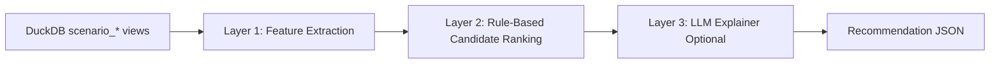

# AI Factory Ops

A rules-first, evidence-driven AI infrastructure operations assistant for the AI Factory challenge.

## One-line pitch

Given a scenario ID, the system extracts deterministic telemetry features, ranks remediation actions with explicit rules, and optionally uses an LLM only to explain (never decide) the recommendation.

## Architecture (three layers)



- **Layer 1 (Deterministic features):** SQL-backed extraction per scenario (`src/features.py`)
- **Layer 2 (Rules):** Explicit, track-aware action candidates with confidence and rule trail (`src/rules.py`)
- **Layer 3 (Explainer):** Optional natural-language rationale from pre-computed facts only (`src/llm.py`)

## Why rules + LLM-as-explainer (not LLM-as-decider)

- Rules make decisions auditable and reproducible.
- LLM output is constrained to explanation quality.
- Offline/demo environments still work using `--no-llm`.
- Avoids scenario hardcoding and keeps recommendations grounded in numeric evidence.

## Repository layout

```text
ai-factory-ops/
  src/
    data.py
    features.py
    rules.py
    runbooks.py
    llm.py
    recommend.py
    ui.py
    cli.py
  tests/
  output/                    # active recommendation JSON outputs
  archive/                   # archived runtime/cache artifacts and logs
  data/                      # symlink to provided data folder
  requirements.txt
  Makefile
  README.md
  DEMO.md
```

## Quickstart

```bash
cd ai-factory-ops
pip install -r requirements.txt
python -m src.cli list-scenarios
```

## Core CLI commands

```bash
python -m src.cli --help
python -m src.cli list-scenarios
python -m src.cli extract --scenario-id perf-001
python -m src.cli propose --scenario-id perf-001
python -m src.cli runbook --scenario-id fail-001
python -m src.cli recommend --scenario-id perf-001 --out output/perf-001.json --no-llm
python -m src.cli recommend-all --no-llm
python -m src.cli ui
```

## Validate against judging hook

Single output:
```bash
python ../ai_factory_hackathon_student/validate_recommendation.py output/perf-001.json
```

All scenarios:
```bash
python ../ai_factory_hackathon_student/validate_recommendation.py --require-all output/all.json
```

## Make targets

```bash
make install
make list-scenarios
make recommend-all
make validate-all
make demo
```

## Testing

```bash
pytest tests/test_features.py
pytest tests/test_rules.py
pytest tests/test_runbooks.py
```

## Notes

- No hardcoded per-scenario recommendation logic is used.
- LLM never reads raw CSVs/tables directly.
- Evidence includes top signals and triggered rule identifiers.
- Keep recommendation outputs in `output/` for CLI/Make validation flows; archive transient caches/logs under `archive/`.
