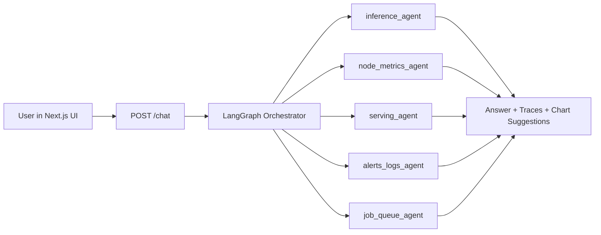

# AI Factory Ops (Web App)

AI Factory Ops is a multi-agent AIOps web application:
- **Backend**: FastAPI + LangGraph orchestrator + DuckDB-backed specialist agents
- **Frontend**: Next.js chat UI with diagnostics and chart rendering (line/bar/area/pie)

This README is intentionally focused on the **web app experience only**.

## Web Stack Overview



## Repository Layout (Web-Relevant)

```text
ai-factory-ops/
  src/
    api.py
    orchestrator.py
    llm.py
    charts.py
    settings.py
    agents/
  web/
    src/app/page.tsx
    package.json
  data/
  output/                    # runtime recommendation outputs used by existing flows
  archive/                   # archived caches/logs
  requirements.txt
  README.md
```

## 1) Environment Setup

### Backend env (`ai-factory-ops/.env`)
`src/settings.py` auto-loads this file.

```bash
# Provider keys (use one or both)
GOOGLE_API_KEY="your-google-ai-studio-key"
GEMINI_API_KEY="your-gemini-key"
OPENAI_API_KEY="your-openai-key"

# Optional model overrides
AIFOPS_ROUTER_MODEL="gemini/gemini-2.0-flash"
AIFOPS_EXPLAINER_MODEL="gemini/gemini-2.0-flash"
```

### Frontend env (`ai-factory-ops/web/.env.local`)
```bash
NEXT_PUBLIC_API_BASE_URL="http://127.0.0.1:8000"
```

## 2) Run the Web App

### Start backend (FastAPI)
```bash
cd ai-factory-ops
pip install -r requirements.txt
python -m uvicorn src.api:app --reload
```

Backend runs at: `http://127.0.0.1:8000`

### Start frontend (Next.js)
```bash
cd ai-factory-ops/web
npm install
npm run dev
```

Frontend runs at: `http://localhost:3000`

## 3) API Contract Used by the UI

### Health
- `GET /health` → `{ "status": "ok" }`

### Chat
- `POST /chat`
- Request:
```json
{ "question": "Why are latency and critical alerts high?" }
```

- Response includes:
  - `answer` (executive + orchestrated summary)
  - `planner_mode`, `planner_debug`
  - `chart_debug`
  - `plan`
  - `agent_results`
  - `traces`
  - `chart_suggestions`

## 4) UI Features

- **Final Answer** with markdown-like formatting
- **Visual Insights** section with chart cards:
  - line / bar / area / pie
- **Diagnostics accordion**:
  - plan
  - agent summaries
  - per-agent trace details (SQL, rows scanned, elapsed time)

## 5) Troubleshooting

- If frontend cannot reach backend:
  - confirm backend is running on `127.0.0.1:8000`
  - confirm `NEXT_PUBLIC_API_BASE_URL` in `web/.env.local`
- If LLM routing fails:
  - verify provider API key in `.env`
  - check `planner_mode` and diagnostics in UI
- If charts do not appear:
  - query may not produce sufficient numeric evidence
  - fallback chart generation still requires valid numeric fields
